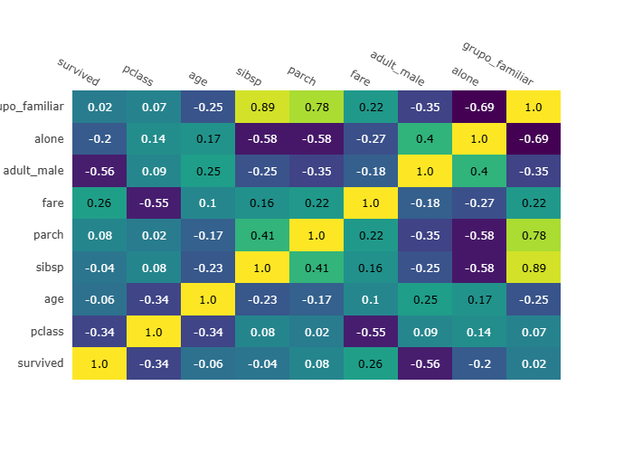
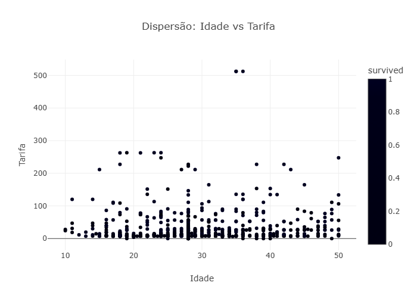
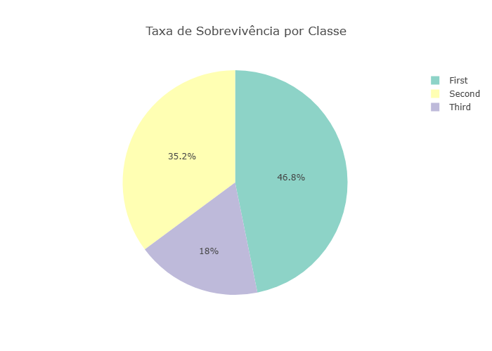

# 🚢 Titanic EDA & Dashboard

Este projeto realiza uma análise exploratória completa do famoso dataset Titanic, com visualizações interativas, estatísticas avançadas e um modelo preditivo. Tudo isso apresentado em um dashboard dinâmico com Streamlit.

## 📊 Funcionalidades

- Limpeza e tratamento de dados
- Criação de variáveis derivadas (feature engineering)
- Testes estatísticos (t-test, ANOVA, Spearman)
- Modelo preditivo com Random Forest
- Visualizações interativas com filtros dinâmicos
- Dashboard com gráficos de dispersão, pizza e mapa de calor

## 🖼️ Exemplos de Visualizações

### 🎯 Mapa de Calor de Correlações


### 📈 Dispersão entre Idade e Tarifa


### 🧁 Pizza de Sobrevivência por Classe


## ▶️ Como Executar

```bash
# Instale as dependências
pip install -r requirements.txt

# Execute o dashboard
streamlit run dashboard/app.py